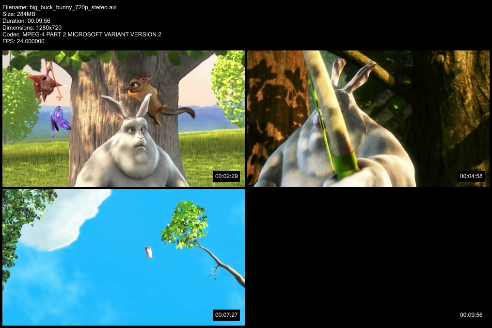

# mt

mt is a lightweight media thumbnailer. it aims to be a simple and fast alternative to outlayers awesome [Video Contact Sheet](http://p.outlyer.net/vcs/)

## Installation

`mt` uses depends on ffmpeg's libraries, so you'll need those installed and then run:

```
go get github.com/mutschler/mt
go install github.com/mutschler/mt
```

if you'll have ffmpeg installed in a non standart directory you'll may have to use PKG_CONFIG_PATH variable like this:

```
LD_LIBRARY_PATH=/path/to/ffmpeg/lib/ PKG_CONFIG_PATH=/path/to//ffmpeg/lib/pkgconfig/ godep go build -x
```

## Settings

Default Settings can be alternated via config files in JSON format, there are 3 directories in which the config can be saved:

`/etc/mt/`, `$HOME/.mt/` and the current directory

just create a file called `md.json` in any of this locations to change the settings...

to change settings on runtime you can either use the provided pflags (mt --help for more info) or set environment Variables with the `MT_` prefix:

`mt --numcaps=20 myvideo.mkg` will change the numcaps settings to 20 for this run only, so will `MT_NUMCAPS=20 mt myvideo.mkv`

since v 1.0.3-dev there is an option to save the current settings to a specified config file:

`mt --save-config=/path/to/config.json`

and load a custom config on runtime:

`mt --config-file=/path/to/config.json`

## Available Config Options:

| name | default value | description |
| ---- | ----- | ----------- |
| numcaps | 4 | number of screenshots to take |
| columns | 2 | how many columns should be used |
| padding | 5 | add a padding around the images |
| width | 400 | width of a single screenshot |
| font_all | "Ubuntu.ttf" | Font to use for timestamps and header |
| font_size | 12 | font size |
| disable_timestamps | false | option to disable timestamp generation |
| timestamp_opacity | 1.0 | opacity of the timestamps must be from 0.0 to 1.0 |
| bg_content | "0,0,0" | RGB values for background color |
| single_images | false | will create a single image for each screenshot |
| header | true | append a header with file informations |
| bg_header | "0,0,0" | header background color |
| fg_header | "255,255,255" | header font color |
| header_image | "" | absolute path to an image that should be added to the header |
| watermark | "" | absolute path to an watermark image that will be added to the middle image of the contact sheet |
| comment | "" | comment that will be added to the bottom-left of the header |
| watermark_all | "" | absolute path to an image that will be added to the bottom left corner of each image |
| filter | "none" | choose a filter to add to the thumbnails: "greyscale", "invert", "fancy", "cross" |
| skip_blank | false | try up to 3 times to skip a blank image (can slow down mt) |
| sfw | false | EXPERIMENTAL nude detection |
| skip_existing | false | skip movie if there is already a jpg with the same name |
| overwrite | false | by default mt will increment the filename by adding -01 if there is already a jpg use --overwrite to overwrite the image instead |
| fast | false | makes mt faster a lot, but seeking will be more inacurate and may produce duplicate screens |
| webvtt | false | create a webvtt file for use with html5 video players |

## Usage

just run `mt` and provide any video file as args:
`mt video.avi`

Some of the settings can be changed through runtime flags provided directly to `mt` for more information just run `mt --help`

### example:

more examples can be found in the example older


